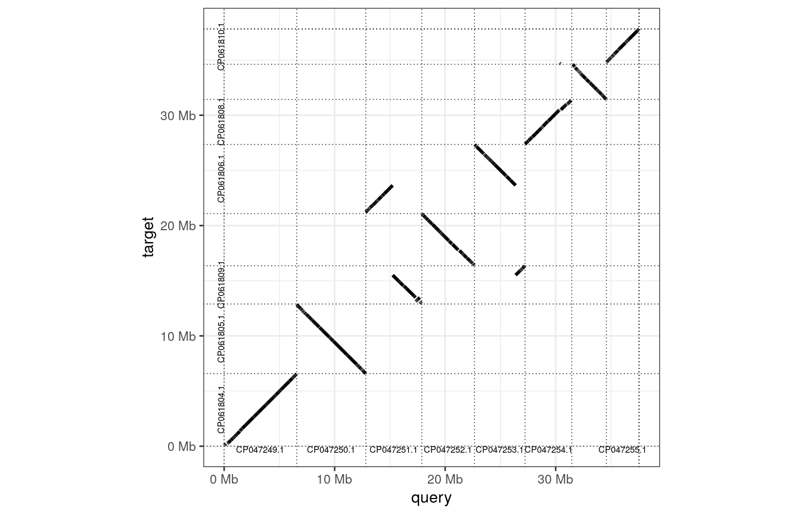
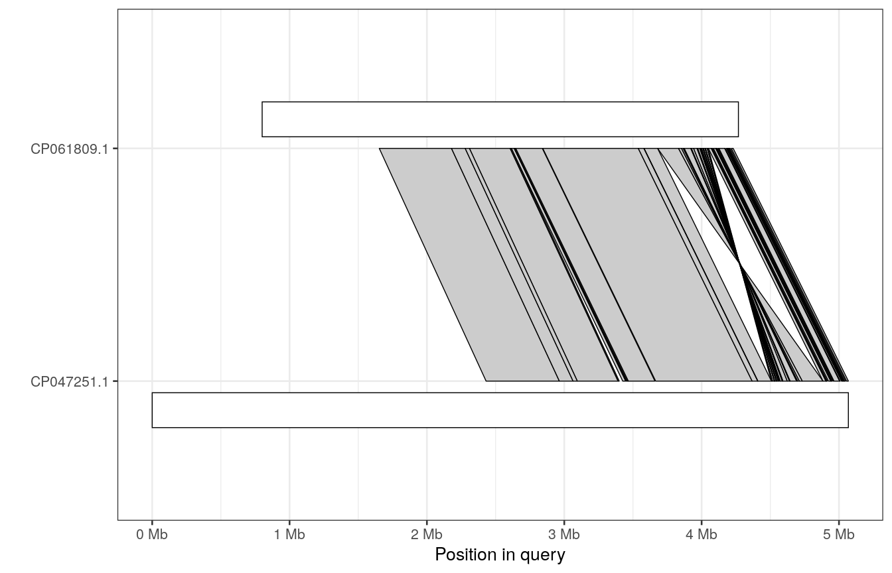

pafr demo
================

# Prerequisites, setting up and running this document

This document demonstrates pafr using both the R code required to read. manipulate and plot alignments and `minimap2` and make the alignments and `bedtools` to analyse some outputs.

To run all of the code you will need minimap2 and bedtools. These program are available in many package managers. For example, you could install them from anaconda:

``` sh
conda install -c bioconda minimap2=2.17
conda install -c bedtools=2.30.0
```

All of the R packages required for the analyses are installed alongside pafr, so you just need to install the package.

``` r
install.packages("pafr")
```

In order to minimize the size of this repository, the sequences required for these analyses are not included. Instead, the script in `scripts/download_genomes.sh` will check if the right sequences exists and download them if not. Running the markdown document will run this script, so you probably don't need to do anything special.

This code block also sets the number of CPUs to use for minimap. Because of the way Rmarkdown runs bash commands environmental variables don't survive from one code block to another. So we store this variable in a file that is sourced every time we need it (`.shell_vars`). Changing '5' in this code block to some other number will change the number of CPUs used in alignment.

``` bash
bash scripts/download_genomes.sh
echo 'export "MM_CPU=5"' > .shell_vars
```

    ## data/seqs/A_flav_SU-16.fna.gz: OK
    ## data/seqs/A_flav_CA14.fna.gz: OK
    ## data/seqs/kea.fna.gz: OK
    ## data/seqs/kakapo.fna.gz: OK

Finally, to run all of the code in this document we can first clone this repository:

``` sh
git clone https://github.com/dwinter/pafr-demo
cd pafr-demo
```

In R from withing the cloned repo you can now use rmarkdown to run this clode and make a local html output:

``` r
rmarkdown::render('README.Rmd')
```

# First example: comparative genomics in fungi

We will start by using pafr to compare two finished genomes. We will use genomes of two *Aspergiullus flavus* isolates and an example.

Because we now these genomes represent two strains on of signle fungal species we will use the `minimap2` present `-x asm5`. This argument sets the alignment paramters such alignments drop off when the best matching sequence ~5% divergent. Note, this does not mean this preset should be used when genomes are *on average* 5% divergent, rather it's the upper limit of the most divergent sections between genomes. The `asm5` present is recommented for within-species comparisons or comparisons of alternative assemblies of the same genome.

The `if` block in this bash code prevents us re-running an alignment if there is an existing one present.

``` bash
source .shell_vars
if [ ! -f data/ali/aflav_ali.paf ];
then
    minimap2 -t ${MM_CPU} -cx asm5 data/seqs/A_flav_CA14.fna.gz data/seqs/A_flav_SU-16.fna.gz > data/ali/aflav_ali.paf
fi
```

Now that we have an alignment we can load pafr and read this file in to our R session.

``` r
library(pafr)

asper <- read_paf("data/ali/aflav_ali.paf")
asper
```

    ## pafr object with 702 alignments (36.5Mb)
    ##  9 query seqs
    ##  9 target seqs
    ##  12 tags: NM, ms, AS, nn, tp, cm, s1, s2, de, zd, rl ...

The print statement of the alignment gives us a brief summary of what the file contains. It is worth remembering that outputs of minimap will typically include secondary alignments (i.e. alternative mappings of a given genomic segment that are nearly as well supported as the primary mapping). The number and genomic distribution of secondary mappings are interesting, but for our purposed we will simply remove these from the alignment.

Very often the fist thing to do with an alignment is make a dotplot to visualise how the two genomes compare.

``` r
asper_clean <- filter_secondary_alignments(asper)
dotplot(asper_clean, order_by="qstart", label_seqs=TRUE)
```



Here we can see many whole chormosomes bascially match up from one to strain to the other. There are also a few rearrangements and what appears to be a small inversion in the `CP047251.1`.

A synteny plot is a nice way to focus in on the alignments btween two of the sequences in a paf file. Here we plot the alignments in the chromsomes associated with that inversion (setting `rc=TRUE` to account for the fact the majority fo alignments are in the reverse and complement).

``` r
plot_synteny(asper, t_chrom="CP061809.1", q_chrom="CP047251.1", rc=TRUE)
```



You can see

``` r
inv <- subset(asper, tname=="CP061809.1" & qname=="CP047251.1" & strand=="+")
inversion_intervals <-  query_bed(inv)
head(inversion_intervals)
```

    ## pafr object with 6 alignments (0Mb)
    ##  1 query seqs
    ##  0 target seqs
    ##  -6 tags:

``` r
write_bed(inversion_intervals, "data/results/inversion_query.bed")
```

``` sh
bedtools merge -d 5000 -i data/results/inversion_query.bed
```

    ## CP047251.1   4408713 4409218
    ## CP047251.1   4508061 4883353

# Comparing draft and finished genome assemblies

``` bash
source .shell_vars
if [ ! -f data/ali/parrots.paf.gz ]
then
    minimap2 -t ${MM_CPU} -cx asm20 data/seqs/kea.fna.gz data/seqs/kakapo.fna.gz | gzip > data/ali/parrots.paf.gz
fi
```

``` r
parrots <- read_paf("data/ali/parrots.paf.gz")
hq_parrots <- subset(filter_secondary_alignments(parrots), mapq > 50)
hq_parrots
```

    ## pafr object with 57638 alignments (1090.8Mb)
    ##  77 query seqs
    ##  34903 target seqs
    ##  11 tags: NM, ms, AS, nn, tp, cm, s1, s2, dv, zd, cg

``` r
dotplot(hq_parrots, order_by="qstart", dashes=FALSE ,label_seqs=TRUE) 
```


``` r
sex_chrom_map <- c("CM013773.2" = "Z", "CM013763.2" = "W")
sex_chrom_ali <- subset(hq_parrots, qname %in% names(sex_chrom_map))
sex_chrom_ali$qname <- sex_chrom_map[sex_chrom_ali$qname]
dotplot(sex_chrom_ali, order_by="qstart" ,label_seqs=TRUE, dashes=FALSE)
```


``` r
hq_parrots_no_Z <- subset(hq_parrots, qname != "CM013773.2")
kea_wing <- "#D73202"
ggplot(hq_parrots_no_Z, aes(alen/tlen)) + 
    geom_histogram(fill=kea_wing, colour='black', binwidth=0.05) + 
    scale_x_continuous()
```


``` r
subset(hq_parrots, alen /tlen > 0.99)
```

    ## pafr object with 20274 alignments (619.1Mb)
    ##  43 query seqs
    ##  20042 target seqs
    ##  11 tags: NM, ms, AS, nn, tp, cm, s1, s2, dv, zd, cg
